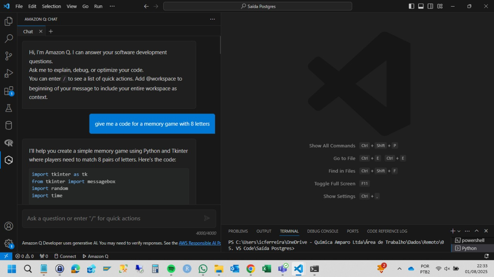
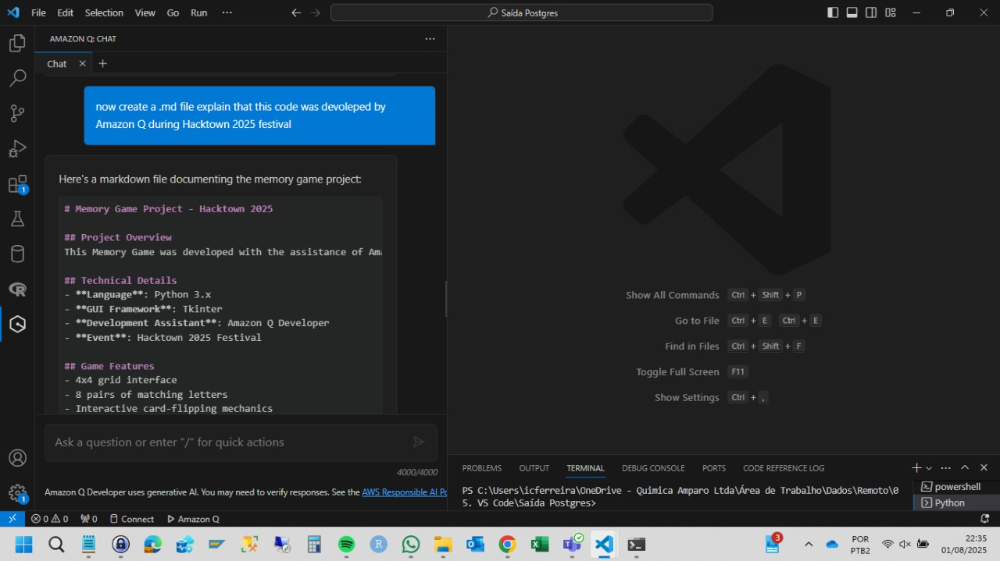

# Memory Game Project - Hacktown 2025

## Project Overview
This Memory Game was developed with the assistance of Amazon Q during the Hacktown 2025 festival. The game demonstrates the capabilities of AI-assisted development in creating interactive Python applications.

## 📸 Screenshots

## Technical Details
- **Language**: Python 3.x
- **GUI Framework**: Tkinter
- **Development Assistant**: Amazon Q Developer
- **Event**: Hacktown 2025 Festival

## Game Features
- 4x4 grid interface
- 8 pairs of matching letters
- Interactive card-flipping mechanics
- Match validation system
- Win condition detection
- User-friendly interface

## Code Structure
The game is built using object-oriented programming principles with the main `MemoryGame` class handling:
- Game board initialization
- Card interaction logic
- Match verification
- Game state management

## How to Play
1. Run the Python script
2. Click cards to reveal letters
3. Find matching pairs
4. Complete the game by matching all pairs

## Development Process
This project showcases the collaborative potential between developers and AI assistants. Amazon Q provided:
- Code structure recommendations
- Implementation guidance
- Best practices integration
- Error handling suggestions

## Requirements
- Python 3.x
- Tkinter (included in standard Python distribution)

## Future Enhancements
Potential improvements for future versions:
- Score tracking
- Timer functionality
- Difficulty levels
- Sound effects
- Animation effects
- High score system

## Project Contributors
- Developer Team: Hacktown 2025 Participants
- AI Assistant: Amazon Q Developer
- Event: Hacktown 2025 Festival

## License
This project is open source and available for educational purposes.

---
*Created during Hacktown 2025 with Amazon Q Developer assistance*

