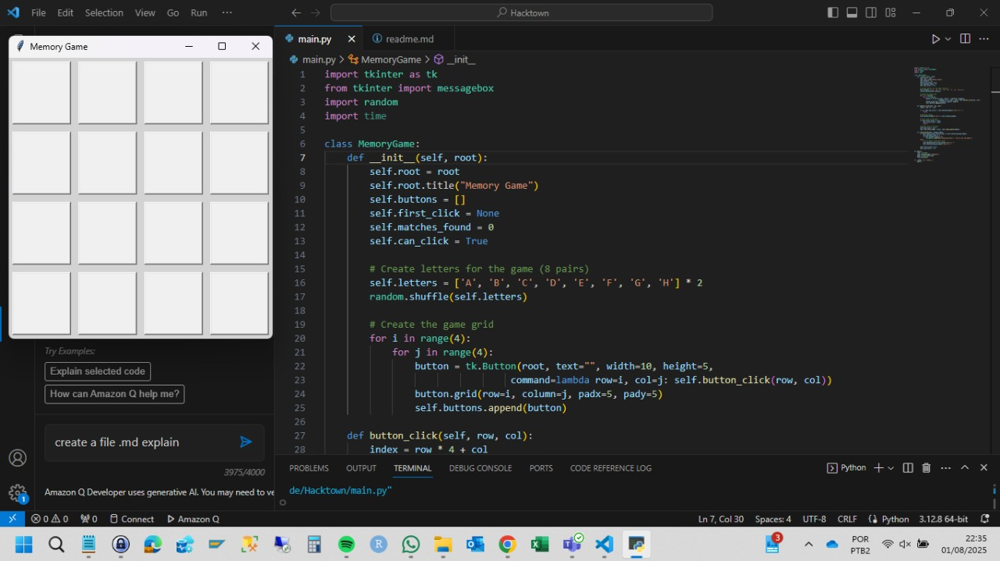
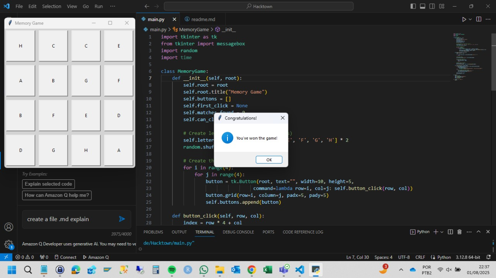

# Memory Game Project - Hacktown 2025

## 📋 Project Overview
This Memory Game was developed with the assistance of Amazon Q Developer CLI during the Hacktown 2025 festival. The game demonstrates the capabilities of AI-assisted development in creating interactive Python applications.

## 📸 Screenshots

## 🔌 Como Instalar Amazon Q Developer CLI no Windows

1. Execute o comando no cmd como adm: "wsl --install"  (Obs: é necessário ter o subsistema linux para windows)
2. sudo apt install unzip
3. curl --proto '=https' --tlsv1.2 -sSf https://desktop-release.codewh isperer.us-east-1.amazonaws.com/latest/q-x86_64-linux-musl.zip -o q.zip
4. unzip q.zip
5. cd q/
6. chmod +x install.sh
7. ./install.sh
   Após isso, você deve selecionar um método de entrada. No meu caso, selecionei a opção 1, "Use for free with Builder ID"

## 🪛 Technical Details
- **Language**: Python 3.x
- **GUI Framework**: Tkinter
- **Development Assistant**: Amazon Q Developer CLI
- **Event**: Hacktown 2025 Festival

## 🕹️ Game Features
- 4x4 grid interface
- 8 pairs of matching letters
- Interactive card-flipping mechanics
- Match validation system
- Win condition detection
- User-friendly interface

## 🤖 Code Structure
The game is built using object-oriented programming principles with the main `MemoryGame` class handling:
- Game board initialization
- Card interaction logic
- Match verification
- Game state management

## 🎮 How to Play
1. Run the Python script
2. Click cards to reveal letters
3. Find matching pairs
4. Complete the game by matching all pairs

## 📝 Development Process
This project showcases the collaborative potential between developers and AI assistants. Amazon Q provided:
- Code structure recommendations
- Implementation guidance
- Best practices integration
- Error handling suggestions

## 💻 Requirements
- Python 3.x
- Tkinter (included in standard Python distribution)

## 🔮 Future Enhancements
Potential improvements for future versions:
- Score tracking
- Timer functionality
- Difficulty levels
- Sound effects
- Animation effects
- High score system

## 👨🏻‍💻 Project Contributors
- Developer Team: Ivan Camargo Ferreira
- AI Assistant: Amazon Q Developer CLI
- Event: Hacktown 2025 Festival

## ✒️ License
This project is open source and available for educational purposes.

---
*Created during Hacktown 2025 with Amazon Q Developer CLI assistance*

